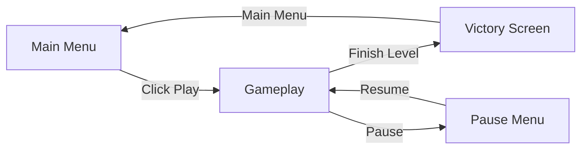
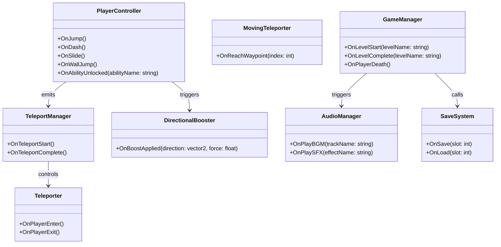

## Developer & Contributions

Muhammad Rafi R (Game Developer)
  <br>

## About

Out of the Box is a 2D puzzle-platformer where you play as a fox and crow duo. You can switch between the fox and crow to get through levels, each bringing their own strengths to help you along the way.The game mixes puzzle-solving and platforming, pushing you to figure out how to use both characters together to progress.
<br>

## Key Features

- **Character Switching** — Swap between the fox and the crow anytime to tackle puzzles and platforming challenges.  
- **Unique Abilities**  
  - **Fox:** double jump, push & pull boxes to clear paths or reach new areas.  
  - **Crow:** fly and carry boxes to higher places (some heavy boxes are too heavy for the crow).  
- **Dynamic Levels** — Reach a trigger point and the level flips/turns, changing its shape and look and revealing new routes and puzzles.  
- **Puzzle & Platforming Mix** — Thoughtful puzzles combined with skill-based platforming.  
- **Teamwork Gameplay** — Combine both characters' abilities to solve puzzles and progress.

<table>
  <tr>
    <td align="left" width="50%">
      
    </td>
  </tr>
</table>

## Scene Flow 


## Layer / module Design 

---
config:
  theme: neutral
  look: neo
---
graph TD
    %% Initialization & Menus
    Start([Game Start])
    Boot[Boot Layer]
    MM[Main Menu]
    Settings[Settings]

    %% Gameplay Core
    GP[Gameplay Scene]
    Switch[Character Switching System]
    Puzzle[Puzzle & Physics System]
    Platforming[Platforming System]
    Flip[Level Flip System]

    %% Characters
    Fox[Fox Abilities<br/>Double Jump, Push/Pull]
    Crow[Crow Abilities<br/>Fly, Carry Boxes]

    %% UI & States
    Pause[Pause Menu]
    Victory[Victory Screen]

    %% Level Progression
    Tutorial[Tutorial Level]
    Level1[Level 1]
    Level2[Level 2]
    Level3[Level 3]

    %% Flows
    Start --> Boot --> MM
    MM -->|Play| Tutorial
    MM --> Settings
    Settings --> MM

    Tutorial -->|Complete| Level1
    Level1 -->|Complete| Level2
    Level2 -->|Complete| Level3
    Level3 -->|Complete| Victory

    GP --> Switch
    Switch --> Fox
    Switch --> Crow
    GP --> Puzzle
    GP --> Platforming
    GP --> Flip

    GP --> Pause
    Pause -->|Resume| GP
    Pause -->|Main Menu| MM

    %% Styles
    classDef initStyle fill:#e1f5fe,stroke:#01579b,stroke-width:2px
    classDef menuStyle fill:#f3e5f5,stroke:#4a148c,stroke-width:2px
    classDef gameplayStyle fill:#e8f5e8,stroke:#1b5e20,stroke-width:2px
    classDef charStyle fill:#fff8e1,stroke:#f57f17,stroke-width:2px
    classDef uiStyle fill:#ffebee,stroke:#b71c1c,stroke-width:2px
    classDef levelStyle fill:#ede7f6,stroke:#311b92,stroke-width:2px

    class Start,Boot initStyle
    class MM,Settings menuStyle
    class GP,Switch,Puzzle,Platforming,Flip gameplayStyle
    class Fox,Crow charStyle
    class Pause,Victory uiStyle
    class Tutorial,Level1,Level2,Level3 levelStyle

```


## Modules and Features

The advanced 2D platformer mechanics including progressive ability unlocks, teleportation system, level management, and dynamic audio are powered by a comprehensive scripting system that creates a unique gameplay experience.

| 📂 Name | 🎬 Scene | 📋 Responsibility |
|---------|----------|-------------------|
| **MainMenu** | **Main Menu** | - Show main menu UI<br/>- Load gameplay scene when player click play button<br/>- Exit game when player exit the game |
| **Setting** | **Main Menu**<br/>**Gameplay** | - Show setting menu (UI)<br/>- Set audio settings<br/>- Configure game preferences |
| **Audio** | **Main Menu**<br/>**Gameplay** | - Play audio (BGM & SFX)<br/>- Set audio volume<br/>- Set audio mute & unmute |
| **PlayerController** | **Gameplay** | - Move player with progressive abilities<br/>- Handle double jump, wall jump, sprint, dash, slide<br/>- Process player input and physics |
| **TeleportationSystem** | **Gameplay** | - Handle teleportation between portals using J key<br/>- Manage teleporter activation and cooldowns<br/>- Support moving teleporters with waypoints |
| **LevelManager** | **Gameplay** | - Manage level progression and boundaries<br/>- Handle camera boundaries and transitions<br/>- Activate teleporters based on context |
| **GameplayMenu** | **Gameplay** | - Handle and show pause game<br/>- Go to main menu when user click main menu button<br/>- Exit game when player click exit game |
| **GameOver** | **Gameplay** | - Show game over panel<br/>- Handle retry & return to main menu<br/>- Manage end screen transitions |
| **PowerUpSystem** | **Gameplay** | - Store and manage power up data available in game<br/>- Spawn power ups throughout levels<br/>- Detect power up triggers and apply effects |
| **PhysicsSystem** | **Gameplay** | - Handle directional boost pads<br/>- Apply physics-based movement forces<br/>- Manage collision detection and responses |
| **SaveSystem** | **Persistent** | - Store setting data and game progress<br/>- Save and load setting data<br/>- Enable progress persistence across sessions |


<br>


## Game Flow Chart


<br>

## Event Signal Diagram





<br>


<br>

## Play The Game

<a href="#">Play Now</a>
<br>


