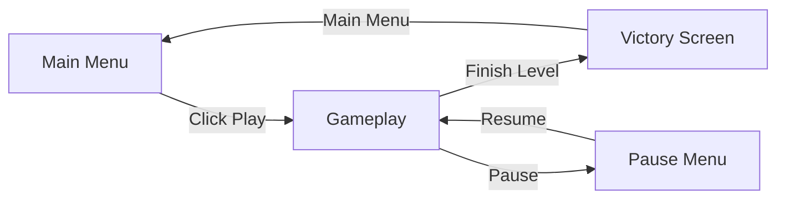
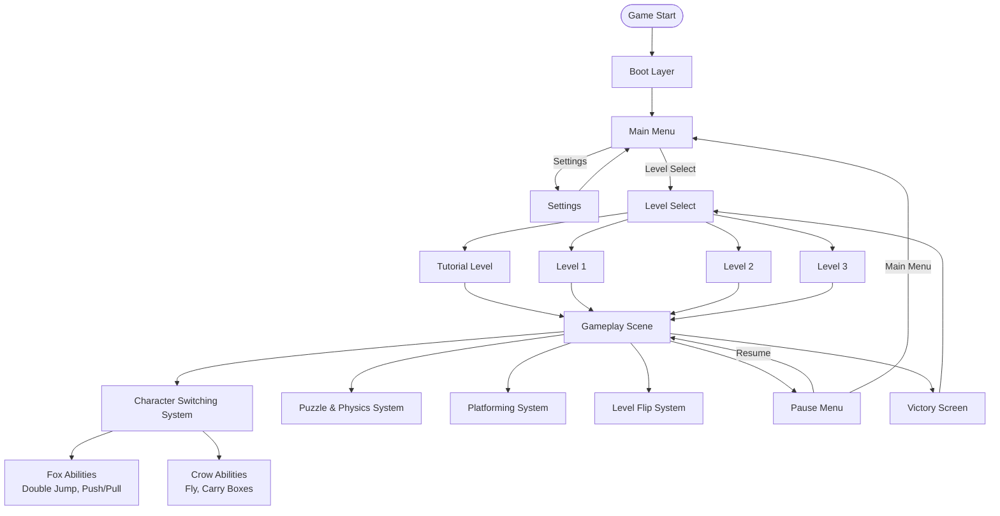
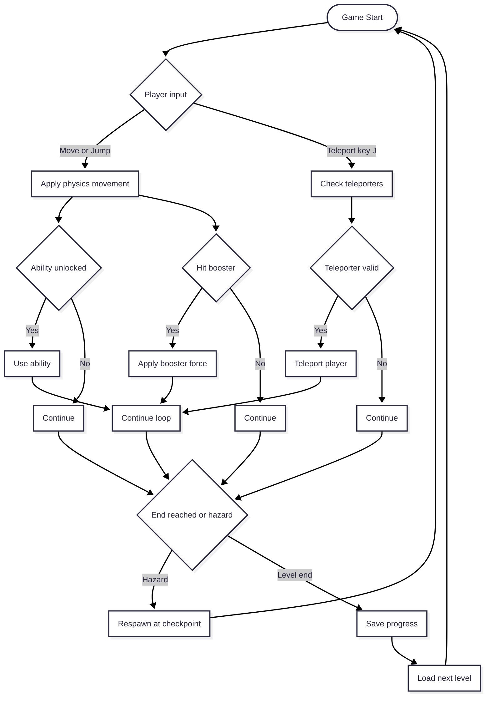
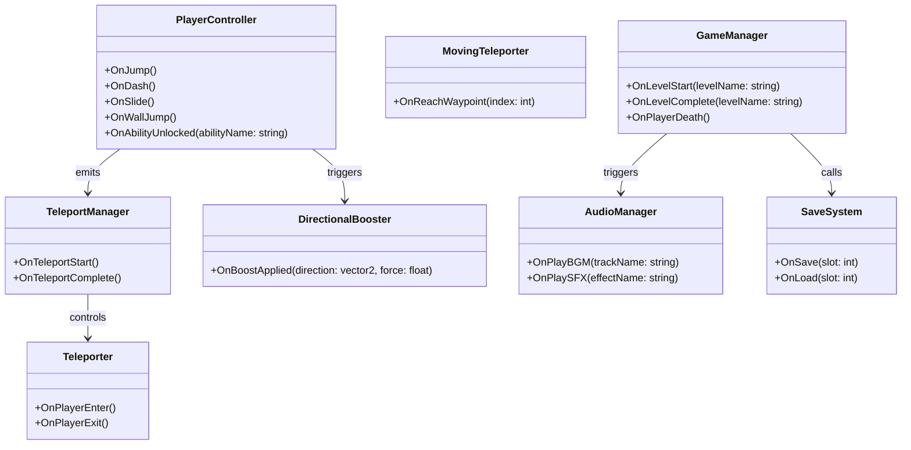

## Developer & Contributions

Muhammad Rafi R (Game Developer)
   

## About

Out of the Box is a 2D puzzle-platformer where you play as a fox and crow duo. You can switch between the fox and crow to get through levels, each bringing their own strengths to help you along the way.The game mixes puzzle-solving and platforming, pushing you to figure out how to use both characters together to progress.
 

## Key Features

- **Character Switching** — Swap between the fox and the crow anytime to tackle puzzles and platforming challenges.  
- **Unique Abilities**  
  - **Fox:** double jump, push & pull boxes to clear paths or reach new areas.  
  - **Crow:** fly and carry boxes to higher places (some heavy boxes are too heavy for the crow).  
- **Dynamic Levels** — Reach a trigger point and the level flips/turns, changing its shape and look and revealing new routes and puzzles.  
- **Puzzle & Platforming Mix** — Thoughtful puzzles combined with skill-based platforming.  
- **Teamwork Gameplay** — Combine both characters' abilities to solve puzzles and progress.

<table>
  <tr>
    <td align="left" width="50%">
      
    </td>
  </tr>
</table>

## Scene Flow 

## Layer / Module Design 

## Modules and Features

The advanced 2D platformer mechanics including progressive ability unlocks, teleportation system, level management, and dynamic audio are powered by a comprehensive scripting system that creates a unique gameplay experience.

| 📂 Name              | 🎬 Scene                       | 📋 Responsibility                                                                                                               |
| -------------------- | ------------------------------ | ------------------------------------------------------------------------------------------------------------------------------- |
| **MainMenu**         | **Main Menu**                  | - Show main menu UI - Allow player to select Tutorial, Level 1, Level 2, or Level 3 - Exit game when player quits       |
| **Settings**         | **Main Menu** **Gameplay** | - Show settings menu (UI) - Configure audio volume - Adjust basic game preferences                                      |
| **AudioSystem**      | **Main Menu** **Gameplay** | - Play background music & sound effects - Adjust or mute audio based on settings                                            |
| **PlayerController** | **Gameplay**                   | - Handle movement & physics for both characters - Manage input for Fox and Crow - Enable switching between Fox and Crow |
| **FoxModule**        | **Gameplay**                   | - Allow double jump - Push & pull boxes                                                                                     |
| **CrowModule**       | **Gameplay**                   | - Enable flight - Carry boxes to higher platforms (except heavy boxes)                                                      |
| **PuzzleSystem**     | **Gameplay**                   | - Manage box interactions and puzzle logic - Detect puzzle completion triggers                                              |
| **FlipSystem**       | **Gameplay**                   | - Trigger level flip/rotation events - Change layout and open new routes                                                    |
| **LevelManager**     | **Gameplay**                   | - Handle level loading (Tutorial, L1, L2, L3) - Manage transitions between levels - Track level completion              |
| **PauseMenu**        | **Gameplay**                   | - Show pause menu - Resume gameplay or return to main menu                                                                  |
| **VictoryScreen**    | **Victory Screen**             | - Display when a level is completed - Allow return to Main Menu or Level Select                                             |

 

## Game Flow Chart

 

## Event Signal Diagram

 

 

## Play The Game

<a href="#">Play Now</a>
 

