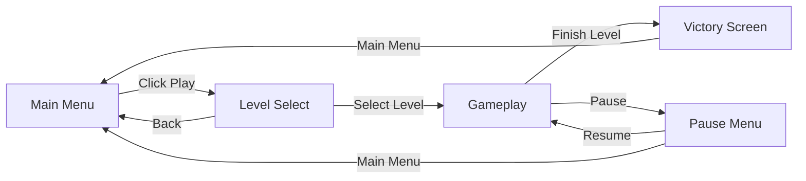
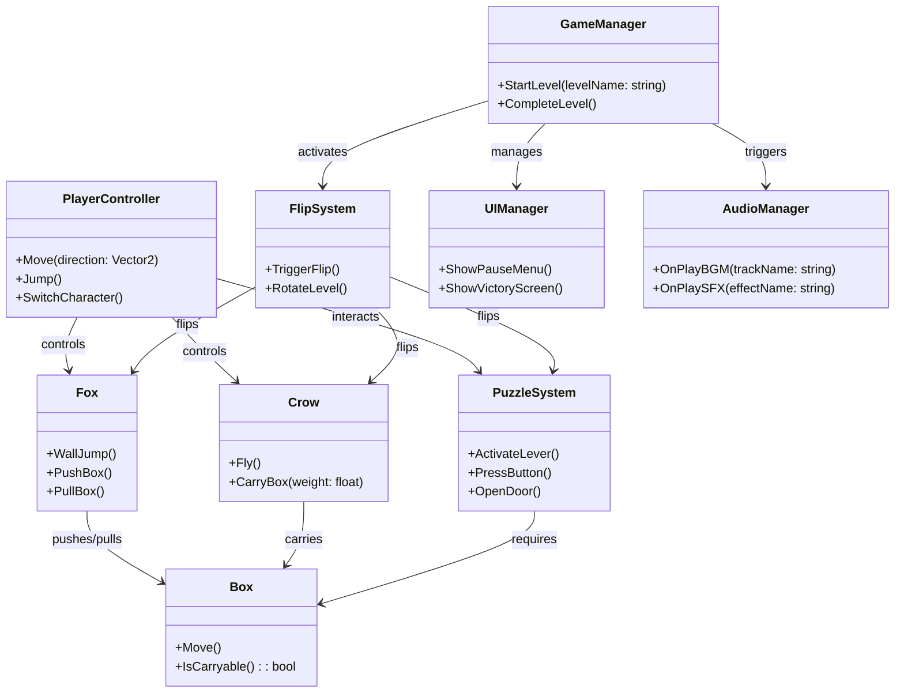

## Developer & Contributions

Muhammad Rafi R (Game Developer)
   

## About

Out of the Box is a 2D puzzle-platformer where you play as a fox and crow duo. You can switch between the fox and crow to get through levels, each bringing their own strengths to help you along the way.The game mixes puzzle-solving and platforming, pushing you to figure out how to use both characters together to progress.
 

## Key Features

- **Character Switching** — Swap between the fox and the crow anytime to tackle puzzles and platforming challenges.  
- **Unique Abilities**  
  - **Fox:** double jump, push & pull boxes to clear paths or reach new areas.  
  - **Crow:** fly and carry boxes to higher places (some heavy boxes are too heavy for the crow).  
- **Dynamic Levels** — Reach a trigger point and the level flips/turns, changing its shape and look and revealing new routes and puzzles.  
- **Puzzle & Platforming Mix** — Thoughtful puzzles combined with skill-based platforming.  
- **Teamwork Gameplay** — Combine both characters' abilities to solve puzzles and progress.

<table>
  <tr>
    <td align="left" width="50%">
      
    </td>
  </tr>
</table>

## Scene Flow 

## Layer / Module Design 

## Modules and Features

The advanced 2D platformer systems — including character switching, puzzle interactions, level progression, and dynamic audio — are powered by a modular scripting structure.
Each module is responsible for managing specific aspects of gameplay, UI, or global systems to ensure smooth transitions and responsive player control.

| 📂 **Name**                 | 🎬 **Scene / Scope** | 📋 **Responsibility**                                                                                                                                    |
| --------------------------- | -------------------- | -------------------------------------------------------------------------------------------------------------------------------------------------------- |
| **GameManager**             | **Gameplay**         | - Controls overall game state (playing, paused, level complete, failed) - Coordinates transitions between menus, levels, and victory screens         |
| **AudioManager**            | **Global**           | - Manages background music (OST) and sound effects (SFX) - Handles audio settings such as volume and mute controls                                   |
| **MainMenu**                | **Main Menu**        | - Displays the main menu interface - Provides access to level selection, settings, and exit options                                                  |
| **OptionsPanel**            | **Main Menu**        | - Adjusts and applies user preferences (e.g., audio volume) - Saves settings for future sessions                                                     |
| **LevelsPanel**             | **Main Menu**        | - Handles level selection - Loads the selected scene or level into gameplay                                                                          |
| **Canvas / UI (Gameplay)**  | **Gameplay**         | - Manages on-screen UI elements such as HUD, pause menu, and level complete screens - Displays player feedback and progress indicators               |
| **Rotator (Flip System)**   | **Gameplay**         | - Handles level rotation mechanics - Dynamically alters the environment to reveal new paths or puzzle solutions                                      |
| **Puzzle Objects (Grid)**   | **Gameplay**         | - Manages interactable puzzle elements (e.g., levers, doors, buttons, pop-up walls) - Responds to player interactions and triggers logical responses |
| **LargeMoveableBox**        | **Gameplay**         | - Heavy interactable object - Can be pushed or pulled by the **Fox** but not lifted - Used in environmental puzzles                              |
| **SmallTrash**              | **Gameplay**         | - Lightweight object - Can be picked up and carried by the **Crow** to solve certain puzzles                                                         |
| **Fox**                     | **Gameplay**         | - Playable character focused on strength-based actions - Can wall-jump, push, and pull heavy objects                                                 |
| **Crow**                    | **Gameplay**         | - Playable character focused on agility - Can fly and carry light objects to assist in puzzle-solving                                                |
| **Character Switch System** | **Gameplay**         | - Handles input-based switching between the Fox and the Crow - Ensures smooth transitions while retaining control context                            |
| **FoxAndCrowDetector**      | **Gameplay**         | - Detects when both Fox and Crow reach the exit area - Triggers level completion event through **GameManager**                                       |
| **ExitDoorR**               | **Gameplay**         | - Represents the exit point of each level - Works with **FoxAndCrowDetector** to activate victory conditions                                         |

 

## Game Flow Chart

 

## Event Signal Diagram

 
