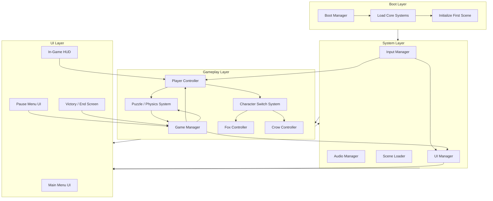

## Developer & Contributions

Muhammad Rafi R (Game Developer)
   

## About

Out of the Box is a 2D puzzle-platformer where you play as a fox and crow duo. You can switch between the fox and crow to get through levels, each bringing their own strengths to help you along the way.The game mixes puzzle-solving and platforming, pushing you to figure out how to use both characters together to progress.
 

## Key Features

- **Character Switching** — Swap between the fox and the crow anytime to tackle puzzles and platforming challenges.  
- **Unique Abilities**  
  - **Fox:** double jump, push & pull boxes to clear paths or reach new areas.  
  - **Crow:** fly and carry boxes to higher places (some heavy boxes are too heavy for the crow).  
- **Dynamic Levels** — Reach a trigger point and the level flips/turns, changing its shape and look and revealing new routes and puzzles.  
- **Puzzle & Platforming Mix** — Thoughtful puzzles combined with skill-based platforming.  
- **Teamwork Gameplay** — Combine both characters' abilities to solve puzzles and progress.

<table>
  <tr>
    <td align="left" width="50%">
      
    </td>
  </tr>
</table>

## Scene Flow 

## Layer / Module Design 

## Modules and Features

The advanced 2D platformer mechanics including progressive ability unlocks, teleportation system, level management, and dynamic audio are powered by a comprehensive scripting system that creates a unique gameplay experience.

| 📂 Name                    | 🎬 Scene      | 📋 Responsibility                                                                                                                                       |
| -------------------------- | ------------- | ------------------------------------------------------------------------------------------------------------------------------------------------------- |
| **GameManager**            | **Gameplay**  | - Oversees game state (playing, paused, level complete) - Connects systems like level completion and transitions                                    |
| **AudioManager**           | **Global**    | - Handles background music (OST) and sound effects (SFX) - Controls volume and muting                                                               |
| **MainMenu**               | **Main Menu** | - Displays the main menu UI - Lets player choose Tutorial, Level 1, Level 2, or Level 3 - Provides buttons for starting, settings, and quitting |
| **OptionsPanel**           | **Main Menu** | - Adjusts audio settings - Applies user preferences                                                                                                 |
| **Levels Panel**           | **Main Menu** | - Level selection screen - Directly loads the chosen level                                                                                          |
| **Canvas / UI (Gameplay)** | **Gameplay**  | - Displays HUD elements - Shows panels like **LevelCompletePanel** and Pause Menu                                                                   |
| **Rotator (Flip System)**  | **Gameplay**  | - Handles level flipping/rotation - Dynamically changes the layout and reveals new routes                                                           |
| **Puzzle Objects (Grid)**  | **Gameplay**  | - Contains puzzle elements: PopupWalls, Levers, Buttons, Doors - Reacts to player interactions to unlock paths                                  |
| **LargeMoveableBox**       | **Gameplay**  | - Heavy interactable object - Can be pushed/pulled by the Fox - Too heavy for the Crow                                                          |
| **SmallTrash**             | **Gameplay**  | - Light objects - Can be carried by the Crow                                                                                                        |
| **Fox**                    | **Gameplay**  | - Playable character - Wall jump, push, pull objects                                                                                              |
| **Crow**                   | **Gameplay**  | - Playable character - Fly and carry light objects                                                                                                  |
| **FoxAndCrowDetector**     | **Gameplay**  | - Detects when both characters reach the exit - Triggers level completion                                                                           |
| **ExitDoorR**              | **Gameplay**  | - Level exit - Works with FoxAndCrowDetector to trigger victory state                                                                               |

 

## Game Flow Chart

 

## Event Signal Diagram

 
